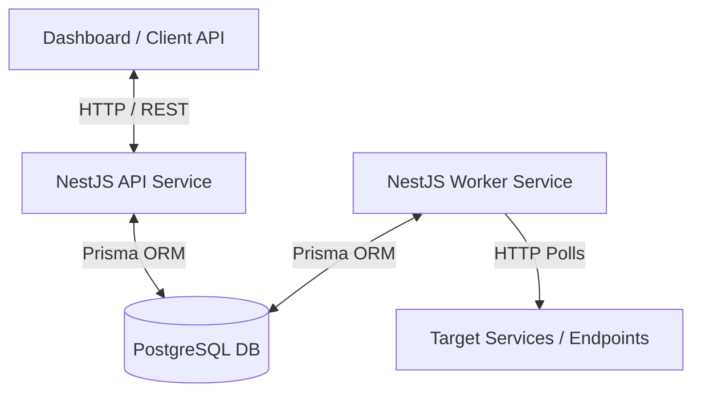
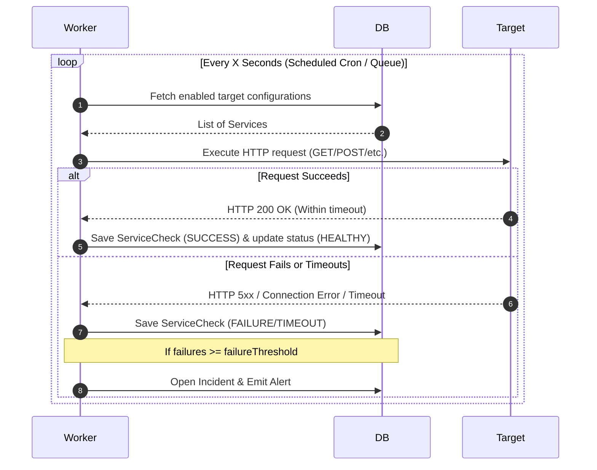

# PulseGuard - System Architecture

PulseGuard is a distributed, high-performance monitoring platform designed to verify the uptime, reliability, and response times of configured HTTP/HTTPS endpoints. 

---

## 1. High-Level Component Overview

The system is organized as a monorepo consisting of:
- **API Application (`apps/api`)**: A NestJS-based web API acting as the gateway for users. It manages authentication, user management, and monitor configuration.
- **Worker Application (`apps/worker`)**: A NestJS background task executor responsible for scheduling and executing periodic polling of configured targets.
- **Shared Package (`packages/shared`)**: Shared types, configurations, constants, and schema utilities reused across the apps.
- **Database (Prisma & PostgreSQL)**: Schema representation for users, monitor configurations, check histories, incidents, alerts, and audit logs.

---

## 2. Core Components & Responsibilities

### API Service (`apps/api`)
- **Authentication & Security**: Handles user signup, login, and secure token verification (JWT with refresh token rotation).
- **Configuration Hub**: Manages CRUD endpoints for monitoring targets (defined as `Service` in the schema).
- **Incident & Alert Access**: Exposes dashboards or feeds of ongoing incidents and alert histories.

### Worker Service (`apps/worker`)
- **Heartbeat & Status Polling**: Queries active targets (`Service` config) and invokes HTTP requests to test status.
- **State Machine Evaluator**: Evaluates whether a service is `HEALTHY`, `DEGRADED`, or `DOWN` based on consecutive failures or successes.
- **Failure Escalation**: Creates `Incident` and `Alert` records when thresholds are breached.

### Data Store (`Prisma Schema`)
- **`User` / `RefreshToken`**: Handles Identity and Access Management (IAM).
- **`Service`**: Configures polling intervals, methods, retry counts, thresholds, and target URL.
- **`ServiceCheck`**: Records time-series results of each check (response code, response time, status).
- **`Incident`**: Tracks outages from detection to acknowledgment and resolution.
- **`Alert`**: Dispatches alert history payloads when critical state events occur.

---

## 3. Data Flow

### Health Polling & Outage Flow

