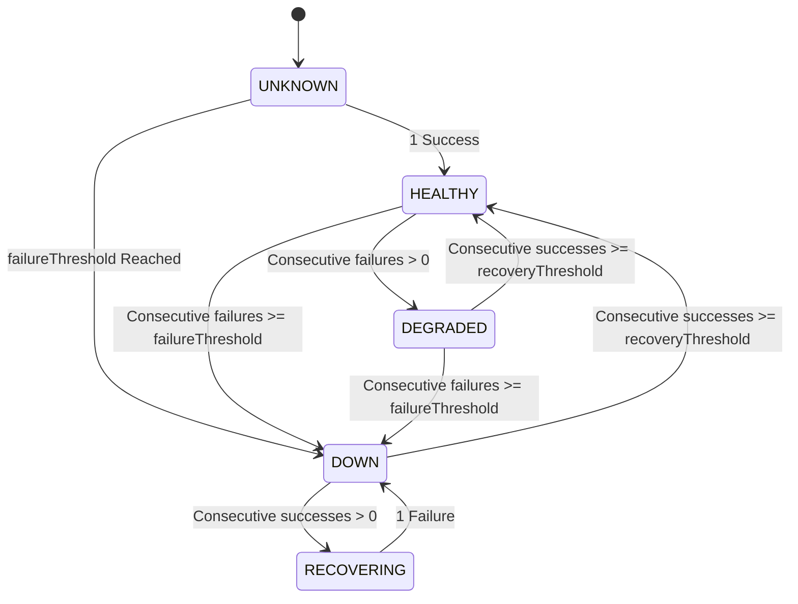

# PulseGuard - Reliability & Resilience Engineering

PulseGuard is designed to be highly reliable and self-healing. Since it monitors external services that may have intermittent outages, unstable networks, or slow response profiles, it incorporates resilience patterns to avoid false positives and prevent alert fatigue.

---

## 1. Monitor State Machine & Flap Protection

To prevent "alert flapping" (rapid triggering and resolution of alerts due to a jittery network connection), PulseGuard implements a strict threshold-based state machine.

### Threshold Rules (Prisma Schema Configuration)
- **`failureThreshold`**: The number of consecutive checks that must fail (status is `FAILURE` or `TIMEOUT`) before the monitor status transitions to `DOWN` and triggers an `Incident`.
- **`recoveryThreshold`**: The number of consecutive checks that must succeed (status is `SUCCESS`) before a down or degraded monitor transitions back to `HEALTHY` and resolves the active `Incident`.

---

## 2. Retry Strategies & Timeout Handling

Each polling task executed by the background worker service enforces strict isolation:
1. **Response Timeouts (`timeoutMs`)**: Every HTTP request has a timeout limit. If the server does not reply within this threshold, it is aborted and marked as `TIMEOUT` rather than blocking the worker thread.
2. **Immediate Retries (`retryCount`)**: When a health check fails, the worker can execute up to `retryCount` immediate retries (or retries with brief delay) before designating the current `ServiceCheck` run as a complete failure. This filters out transient packet loss.

---

## 3. Circuit Breaker Pattern

PulseGuard utilizes a Circuit Breaker pattern to protect target service resources and conserve monitoring infrastructure capacity:
- **`CLOSED` (Normal)**: Polling happens normally at the service's defined `intervalSeconds`.
- **`OPEN` (Tripped)**: If the target service breaches `failureThreshold`, the circuit opens. In this state, regular polling is suspended or significantly slowed down, preventing the system from spamming an already offline/overloaded service.
- **`HALF-OPEN` (Testing)**: After a cooldown period, the worker performs a single test probe.
  - If the probe succeeds, the circuit returns to `CLOSED` (or moves towards `HEALTHY` based on `recoveryThreshold`).
  - If the probe fails, the circuit returns to `OPEN` and resets the cooldown timer.

---

## 4. Alert Fatigue Mitigation

To prevent operational fatigue from duplicate alarms:
1. **Single Incident Lifetime**: An incident remains `OPEN` or `ACKNOWLEDGED`. While it is open, duplicate failure checks will not trigger new incidents or spam alerts; they only attach metadata to the existing incident.
2. **Deduplication & Rate Limiting**: Alerts are grouped and rate-limited. Alerts like `SERVICE_DOWN` are only fired once per transition event, rather than for every single failed check execution.
